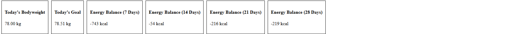
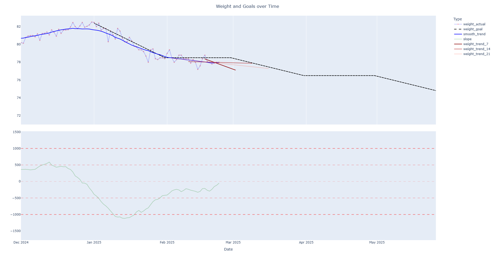
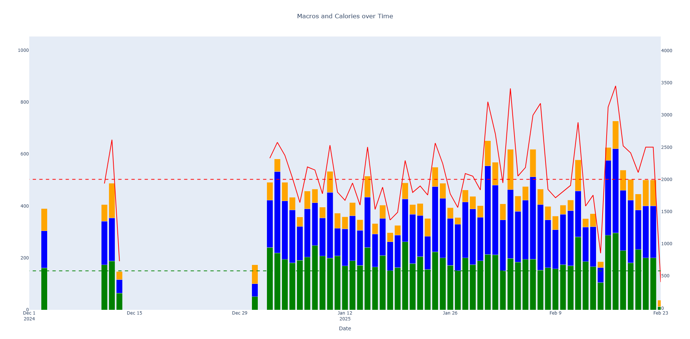
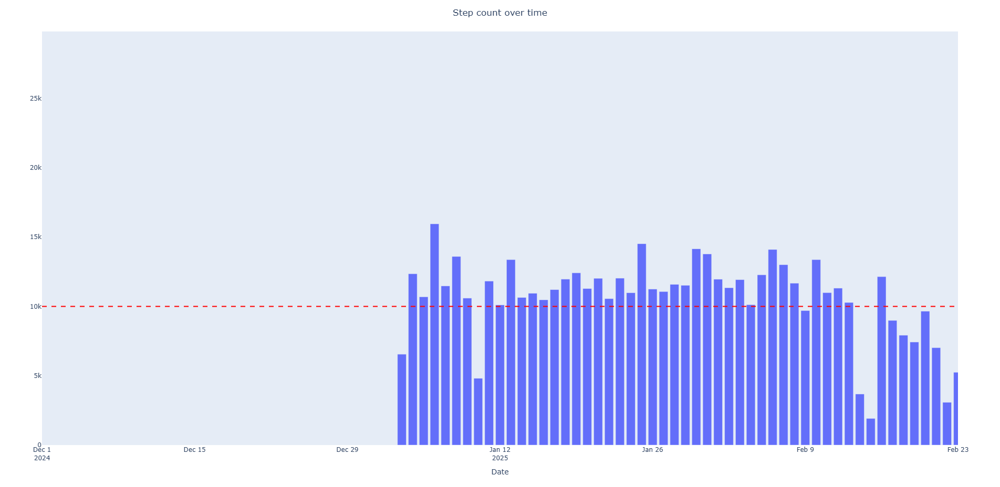

# FitBot
Dashboard to visualize my fitness goals

it looks something like this (github won't allow html with js so I had to copy and paste bits of html and loads images instead.):

<div style="background-color: white; padding: 10px; font-family: sans-serif; color: black">
<!-- <div style="display: flex; flex-direction: row; align-items: center;"><div id="weight-info-box" style="border: 1px solid black; padding: 10px; margin: 5px;"><h4>Today's Bodyweight</h4><p id="today-bw">78.00 kg</p></div><div id="goal-info-box" style="border: 1px solid black; padding: 10px; margin: 5px;"><h4>Today's Goal</h4><p id="today-goal">78.51 kg</p></div><div id="energy-balance-7-box" style="border: 1px solid black; padding: 10px; margin: 5px;"><h4>Energy Balance (7 Days)</h4><p id="energy-balance-7">-743 kcal</p></div><div id="energy-balance-14-box" style="border: 1px solid black; padding: 10px; margin: 5px;"><h4>Energy Balance (14 Days)</h4><p id="energy-balance-14">-54 kcal</p></div><div id="energy-balance-21-box" style="border: 1px solid black; padding: 10px; margin: 5px;"><h4>Energy Balance (21 Days)</h4><p id="energy-balance-21">-216 kcal</p></div><div id="energy-balance-28-box" style="border: 1px solid black; padding: 10px; margin: 5px;"><h4>Energy Balance (28 Days)</h4><p id="energy-balance-28">-219 kcal</p></div></div> -->
    <div style="padding: 10px; margin-bottom: 20px; height: 110px;">
        
    </div>
    <div style="border: 2px solid black; padding: 10px; margin-bottom: 20px; height: 1000px;">
        
    </div>
    <div style="border: 2px solid black; padding: 10px; margin-bottom: 20px; height: 500px;">
        
    </div>
    <div style="border: 2px solid black; padding: 10px; margin-bottom: 20px; height: 500px;">
        
    </div>
</div>

# What it does
One thread is set up to request data from the fitbit web api (using [orcasgit](https://github.com/orcasgit/python-fitbit)) every 70 seconds or so. It writes that data to a database in /data. Mean while the dashapp reloads the web page every 10s. On each reload, it requests data from the databse and generates the plots and derives estimates of my caloric balance.

# Why?
Weight loss can be a pain. It is often very hard to know if you are losing weight at an adequate rate, just by looking at the scales (since it's so volatile). This dashboard makes a rolling linear regression of your bodyweight over 7, 14, 21 and 28 days. The slopes of those lines are in kg per day, [which can be converted into calories.](<https://onefitness.com.au/the-real-facts-about-burning-body-fat/#:~:text=There%20are%207%2C700kcals%20(kcal,time%20to%20burn%20that%20fat.>). For a long-term weight loss phase (>4 weeks) you want to be around the -500kcal/day mark. For short term weight loss phases (<= 4 weeks), you can get away with (-1000kcal) without too many negative effects. 

It can also be used for bulking. ie if you are bulking you do not want to be in a +1000kcal surplus each day as most of that gain will be fat. Instead, you would want to aim for +250-500kcal depending on your situation.

This Dashboard allows me to titrate my daily expenditure (ie steps) and my daily intake (calories) while answering other questions like "My muscles feel very sore, have I been getting enough protein?", "I feel weak in the gym, have I been eating enough carbs?" etc.

# Usage:
1. clone this repo
2. go to [orcasgit](https://github.com/orcasgit/python-fitbit) and follow the steps to get your api keys. Save them in the assets folder in 'creds.json' like this
```json
{
    "CLIENT_ID": "my client id",
    "CLIENT_SECRET" : "my secret id"
}
```
3. update the Goals.xlsx file in the assets folder to set your goals.
4. ensure that you are logging your bodyweight in the fitbit app on your phone.
5. ensure that you are logging your calories/macros on the fitbit app (or myfitnesspal, but you need to sync the two apps on your phone)
6. ensure that you are logging your steps in the fitbit app/wearing a fitbit which is synced to the app.
7. if you want to import more history (as a once off), go to constants.py and edit the DAYS_TO_UPDATE parameter. Beware that the rate limit is 150 requests per hour, so it can't be greater than 147.
8. install requirements
```bash
C:/path/to/where/you/cloned/it> cd FitBot
C:/path/to/where/you/cloned/it/FitBot> pip install -r requirements.txt
```
9. run the app
```bash
C:/path/to/where/you/cloned/it> python FitBot -m
```

edit constants.py to tailor it to your needs.
